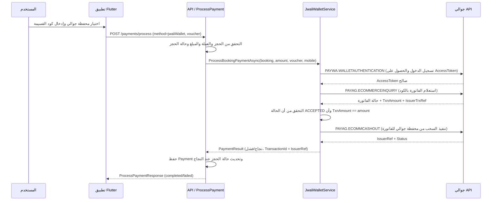

# توثيق تدفق الدفع عبر المحافظ (جوالي + سبأ كاش)

هذا الملف يشرح **بدقّة** كيف يتم تدفق الدفع بين:

- تطبيق العميل (Flutter)
- واجهة الـ API (`/api/client/payments/process`)
- خدمات المحافظ في الباك‑إند:
  - `JwaliWalletService` لمحفظة جوالي
  - `SabaCashWalletService` لمحفظة سبأ كاش

مع توضيح التعامل مع **العملة** في كل طبقة.

---

## 1. التعامل مع العملات (Currency Handling)

### 1.1 على مستوى الطلب من العميل

عند استدعاء **ProcessPayment** من Flutter يتم إرسال الحقول الأساسية:

- `bookingId` : معرف الحجز
- `userId` : معرف المستخدم
- `amount` : مبلغ الدفع (double)
- `paymentMethod` : اسم طريقة الدفع (مثلاً `jwaliWallet` أو `sabaCashWallet`)
- `currency` : كود العملة (حاليًا تستخدم `YER`)
- `paymentDetails` : كائن JSON إضافي حسب الطريقة

### 1.2 في معالج الدفع في الباك‑إند

في `ProcessPaymentCommandHandler`:

1. يتم قراءة عملة الطلب من: `request.Amount.Currency`.
2. تتم مقارنة هذه العملة مع عملة الحجز المخزنة في كيان `Booking`:
   - إذا كانت مختلفة → يرجع خطأ `CURRENCY_MISMATCH`.
3. يتم التأكد أن العملة مدعومة في إعدادات النظام عبر `ICurrencySettingsService`.
4. في حالة جوالي وسبأ كاش، **لا يتم إرسال العملة إلى مزود المحفظة** مباشرة، لأن هذه المحافظ تعمل عملياً بالريال اليمني YER،
   ولكن **المبلغ نفسه** يكون هو مبلغ الفاتورة بالريال.

بالتالي:
- دقّة العملة مضمونة على مستوى **النظام الداخلي** (Booking + Validation).
- مزود المحفظة يفترض أن العملة = عملة النظام (YER)، لذلك لا نحتاج حقل عملة منفصل في استدعاءات جوالي/سبأ كاش.

---

## 2. تدفق الدفع عبر محفظة جوالي (JwaliWallet)

### 2.1 من جهة العميل (Flutter)

1. المستخدم يختار طريقة الدفع `محفظة جوالي` من شاشة الدفع.
2. يظهر حوار إدخال كود جوالي:
   - عنوان مثل: "إدخال كود شراء جوالي".
   - المستخدم يُدخل **كود القسيمة** الذي أنشأه في تطبيق جوالي.
3. عند تأكيد الدفع:
   - يُبنى `paymentDetails` في Flutter كما يلي:

   ```json
   {
     "voucher": "<كود_جوالي>",
     "walletNumber": "<كود_جوالي>",
     "walletPin": "<كود_جوالي>"
   }
   ```

4. يتم إرسال طلب POST إلى `/api/client/payments/process` يحتوي على:
   - `paymentMethod = jwaliWallet`
   - `amount`, `currency = "YER"`
   - `paymentData` في جسم الطلب يحتوي على `voucher`.

### 2.2 في API (ProcessPaymentCommandHandler)

1. المعالج يستقبل `ProcessPaymentCommand` ويتحقق من:
   - صحة المبلغ (عدد المنازل العشرية).
   - تطابق العملة مع الحجز.
   - حالة الحجز (يجب أن تكون Pending).
   - توفر الوحدة في التواريخ.
   - عدم وجود دفعة ناجحة سابقة.

2. إذا كانت طريقة الدفع `JwaliWallet`:
   - يتم استدعاء:

     ```csharp
     _jwaliWalletService.ProcessBookingPaymentAsync(
         booking,
         request.Amount.Amount,
         voucher,
         receiverMobile,
         cancellationToken)
     ```

   - حيث:
     - `voucher` يتم استخراجه من `request.PaymentData["voucher"]`.
     - إذا لم يوجد، يُستخدم `request.WalletId` كبديل.
     - `receiverMobile` هو رقم جوال المستخدم من `booking.User.Phone`.

### 2.3 داخل JwaliWalletService

#### 2.3.1 الحصول على AccessToken

1. يتم استدعاء `GetAccessTokenAsync`:
   - إذا كان هناك توكن محفوظ في الـ Cache (`Jwali_AccessToken`) يتم استخدامه.
   - إذا لم يوجد:
     - يبني طلب `JwaliLoginRequest` بخدمة `PAYWA.WALLETAUTHENTICATION`:
       - `Header.ServiceDetail`: يحتوي على `DomainName`, `ServiceName`, `CorrID`.
       - `Body.Identifier`: رقم محفظة الوكيل `Jwali:AgentWallet`.
       - `Body.Password`: كلمة مرور المحفظة `Jwali:Password`.
     - يرسل الطلب إلى `Jwali:BaseUrl` ويستقبل `Access_Token`.
     - يحفظ التوكن في الذاكرة لمدة 30 دقيقة.

#### 2.3.2 استعلام الفاتورة (Inquiry) PAYAG.ECOMMERCEINQUIRY

2. يبني `JwaliEcommerceInquiryRequest`:
   - `Header.ServiceDetail.ServiceName = "PAYAG.ECOMMERCEINQUIRY"`.
   - `Body` يحتوي على:
     - `AgentWallet` : محفظة الوكيل.
     - `Voucher` : كود القسيمة من العميل.
     - `ReceiverMobile` : رقم جوال المستلم (العميل).
     - `Password` : كلمة مرور الوكيل.
     - `AccessToken` : التوكن الذي تم الحصول عليه.
     - `RefId` : معرف مرجعي داخلي (GUID).
     - `Purpose` : نص مثل "Booking Payment #<BookingId>".

3. يرسل الطلب عبر `PostJwaliAsync` ويستقبل `JwaliEcommerceInquiryResponse`:
   - يحتوي على:
     - `IssuerTrxRef` : مرجع العملية من جوالي.
     - `TxnAmount` : مبلغ الفاتورة.
     - `State` : حالة الفاتورة (ACCEPTED / PENDING / REJECTED / EXPIRED).

4. التحقق:
   - إذا كانت `State = PENDING` → يعاد فشل برسالة "الفاتورة ما زالت في حالة انتظار".
   - إذا لم تكن `ACCEPTED` → فشل برسالة توضح أن الفاتورة غير مقبولة.
   - إذا لم يطابق `TxnAmount` مبلغ الحجز `amount` → فشل برسالة اختلاف المبلغ.

#### 2.3.3 تنفيذ السحب (Cashout) PAYAG.ECOMMCASHOUT

5. بعد قبول الفاتورة وتطابق المبلغ:
   - يبني `JwaliEcommerceCashoutRequest`:
     - بنفس بيانات الوكيل، الـ voucher، رقم الجوال، التوكن، `RefId`, `Purpose`.

6. يرسل الطلب ويحصل على `JwaliEcommerceCashoutResponse`:
   - يحتوي على:
     - `Amount` : المبلغ المنفذ.
     - `Balance` : رصيد المحفظة بعد العملية.
     - `IssuerRef` : مرجع العملية.
     - `Status` : حالة العملية (ACCEPTED / SUCCESS / ...).

7. التحقق:
   - إذا لم تكن `Status` من نوع ناجح → يرجع `PaymentResult` بفشل.
   - إذا نجحت:
     - يرجع `PaymentResult`:
       - `IsSuccess = true`
       - `TransactionId = IssuerRef`
       - `Status = PaymentStatus.Successful`
       - `ProcessedAmount = amount`
       - `Fees = 0` (حالياً لا نحسب عمولة إضافية داخل النظام).

### 2.4 الاسترداد عبر جوالي

في `RefundPaymentCommandHandler`:

- إذا كان `payment.PaymentMethod == PaymentMethodEnum.JwaliWallet`:
  - يتم استدعاء:

    ```csharp
    _jwaliWalletService.RefundAsync(payment, booking, refundAmount, reason)
    ```

داخل `JwaliWalletService.RefundAsync`:

1. يتم التحقق من صحة المعطيات (مبلغ > 0، وجود رقم جوال للعميل، وجود `TransactionId` للأصل).
2. يجلب `AccessToken` بنفس طريقة تسجيل الدخول.
3. يبني `JwaliEcommerceRefundRequest` لخدمة `PAYAG.ECOMMERCEREFUND`:
   - `AgentWallet`, `Amount`, `ReceiverMobile`, `Password`, `AccessToken`, `RefId`.
   - `RefundType`: من `Jwali:DefaultRefundType`.
   - `IssuerRef`: رقم العملية الأصلية (من `payment.TransactionId`).
   - `Purpose`: سبب الاسترداد.
4. يرسل الطلب ويستقبل `JwaliEcommerceRefundResponse`:
   - يحتوي على `Amount`, `Status`, `RefId`, `TrxDate`.
5. إذا كانت `Status` ناجحة → يرجع `RefundResult` بنجاح؛ وإلا يرجع فشل برسالة واضحة.

### 2.4.1 مخطط تسلسلي للاسترداد عبر جوالي (Mermaid)

sequenceDiagram
    participant Admin as موظف النظام
    participant API as API / RefundPayment
    participant JW as JwaliWalletService
    participant JWAPI as جوالي API

    Admin->>API: طلب استرداد (RefundPaymentCommand) لدفعة جوالي
    API->>API: تحقق من الدفع والحجز والسياسة وصلاحيات المستخدم
    API->>JW: RefundAsync(payment, booking, refundAmount, reason)
    JW->>JWAPI: PAYWA.WALLETAUTHENTICATION (إذا لزم الحصول على AccessToken)
    JWAPI-->>JW: AccessToken صالح
    JW->>JWAPI: PAYAG.ECOMMERCEREFUND (إرسال طلب الاسترداد)
    JWAPI-->>JW: حالة الاسترداد (Status + RefId + Amount)
    JW-->>API: RefundResult (IsSuccess, RefundId = RefId)
    alt استرداد ناجح
        API->>API: إنشاء Payment جديد بحالة Refunded وتحديث الدفعة الأصلية
        API-->>Admin: ResultDto<bool> (نجاح + رسالة توضح إتمام الاسترداد)
    else استرداد فاشل
        API-->>Admin: ResultDto<bool> (فشل + رسالة من جوالي)
    end

### 2.5 مخطط تسلسلي للدفع عبر جوالي (Mermaid)



---

## 3. تدفق الدفع عبر محفظة سبأ كاش (SabaCashWallet)

### 3.1 من جهة العميل (Flutter)

1. المستخدم يختار طريقة الدفع `محفظة سبأ كاش`.
2. يتم استدعاء الدفع **على مرحلتين**:
   - **المرحلة الأولى**: بدون OTP → فقط يمرر طريقة الدفع والمبلغ.
   - يحصل على `Transaction` بحالة `pending` من الباك‑إند.
   - تظهر نافذة لإدخال **رمز OTP** الذي وصله على جواله من سبأ كاش.
   - **المرحلة الثانية**: استدعاء نفس API مجدداً لكن مع `paymentDetails['otp']`.

### 3.2 في API (ProcessPaymentCommandHandler)

1. إذا كانت طريقة الدفع `PaymentMethodEnum.SabaCashWallet`:
   - يتم تحويل التنفيذ إلى:

     ```csharp
     HandleSabaCashWalletPaymentAsync(request, booking, cancellationToken)
     ```

### 3.3 المرحلة الأولى: تهيئة الدفع (Initiate)

داخل `HandleSabaCashWalletPaymentAsync`:

1. يحاول استخراج `otp` من `request.PaymentData["otp"]`:
   - إذا **لا يوجد OTP**:
     - يستدعي:

       ```csharp
       _sabaCashWalletService.InitiatePaymentAsync(booking, amount)
       ```

2. داخل `SabaCashWalletService.InitiatePaymentAsync` (مبني على تكامل YottaPay):
   - يحصل على توكن من مزود YottaPay.
   - يبني طلب "onlinePayment" لإنشاء Adjustment جديد.
   - يرسل الطلب ويحصل على `Adjustment.Id` (معرّف العملية) ورسالة.
   - يرجع `PaymentResult` بحالة "معلّقة" مع `GatewayTransactionId = Adjustment.Id`.

3. في المعالج:
   - ينشئ كيان Payment بحالة `Pending` ويربطه بالـ `GatewayTransactionId` و `TransactionId`.
   - لا يغيّر حالة الحجز بعد؛ يبقى الحجز Pending.
   - يرجع `ProcessPaymentResponse` إلى العميل مع:
     - `PaymentStatusDto = "pending"`.
     - رسالة توضح أنه تم إرسال OTP.

### 3.4 المرحلة الثانية: تأكيد الدفع (Confirm with OTP)

1. في الاستدعاء الثاني من العميل:
   - يحتوي `paymentData['otp']` على رمز التحقق المكون من 4 أرقام.
2. `HandleSabaCashWalletPaymentAsync` يلتقط الـ OTP:
   - يبحث عن آخر دفعة Pending بمحفظة سبأ كاش لنفس الحجز.
   - يتحقق أن حالتها `Pending`.
   - يستدعي:

     ```csharp
     _sabaCashWalletService.ConfirmPaymentAsync(sabaCashPayment, otp)
     ```

3. داخل `ConfirmPaymentAsync`:
   - يستدعي YottaPay لتأكيد العملية (PATCH على onlinePayment) مع الـ OTP.
   - يتحقق من حالة العملية.
   - يرجع `PaymentResult` بحالة ناجحة أو فاشلة.

4. في المعالج:
   - إذا نجحت العملية:
     - يحدّث حالة الحجز إلى `Confirmed`.
     - يسجل Audit Log لنجاح الدفع.
     - يرجع `ProcessPaymentResponse` بحالة `completed` للعميل.
   - إذا فشلت → يرجع فشل مع الرسالة القادمة من سبأ كاش.

### 3.5 الاسترداد عبر سبأ كاش

في `RefundPaymentCommandHandler`:

- إذا كان `payment.PaymentMethod == PaymentMethodEnum.SabaCashWallet`:
  - يتم استدعاء `ISabaCashWalletService.RefundAsync`:

    ```csharp
    _sabaCashWalletService.RefundAsync(payment, booking, refundAmount, reason)
    ```

داخل `RefundAsync`:

1. يبني طلب استرداد عبر تكامل YottaPay (onlineMoneyReturn) مستخدماً:
   - المعرّف الأصلي للمعاملة.
   - مبلغ الاسترداد.
   - رقم محفظة العميل المستلم، إن لزم.
2. يرسل الطلب ويحصل على استجابة نجاح/فشل.
3. يرجع `RefundResult` إلى المعالج.
4. المعالج ينشئ Payment جديد بحالة `Refunded` ويحدّث الدفعة الأصلية إلى `Refunded` أو `PartiallyRefunded`.

### 3.5.1 مخطط تسلسلي للاسترداد عبر سبأ كاش (Mermaid)

sequenceDiagram
    participant Admin as موظف النظام
    participant API as API / RefundPayment
    participant SC as SabaCashWalletService
    participant YP as YottaPay / SabaCash API

    Admin->>API: طلب استرداد (RefundPaymentCommand) لدفعة سبأ كاش
    API->>API: تحقق من الدفع والحجز وسياسة الاسترداد وحالة الدفعة
    API->>SC: RefundAsync(payment, booking, refundAmount, reason)
    SC->>YP: POST /onlineMoneyReturn (طلب استرداد لمعاملة سابقة)
    YP-->>SC: نتيجة العملية (نجاح/فشل + البيانات المرجعية)
    SC-->>API: RefundResult (IsSuccess, RefundId)
    alt استرداد ناجح
        API->>API: إنشاء Payment جديد بحالة Refunded أو PartiallyRefunded
        API-->>Admin: ResultDto<bool> (نجاح + رسالة توضح إتمام الاسترداد)
    else استرداد فاشل
        API-->>Admin: ResultDto<bool> (فشل + رسالة من سبأ كاش / YottaPay)
    end

### 3.6 مخطط تسلسلي للدفع ثنائي المراحل عبر سبأ كاش (Mermaid)

sequenceDiagram
    participant U as المستخدم
    participant F as تطبيق Flutter
    participant API as API / ProcessPayment
    participant SC as SabaCashWalletService
    participant YP as YottaPay / SabaCash API

    %% المرحلة الأولى: تهيئة الدفع بدون OTP
    U->>F: اختيار محفظة سبأ كاش
    F->>API: POST /payments/process (method=sabaCashWallet, بدون OTP)
    API->>API: التحقق من الحجز والعملة والمبلغ
    API->>SC: InitiatePaymentAsync(booking, amount)
    SC->>YP: POST /onlinePayment (إنشاء Adjustment جديد)
    YP-->>SC: AdjustmentId + رسالة
    SC-->>API: PaymentResult (Pending, GatewayTransactionId = AdjustmentId)
    API->>API: إنشاء Payment Pending وربطه بـ AdjustmentId
    API-->>F: ProcessPaymentResponse (status=pending, رسالة "تم إرسال OTP")

    %% المرحلة الثانية: تأكيد الدفع بالـ OTP
    U->>F: إدخال رمز OTP المستلم من سبأ كاش
    F->>API: POST /payments/process (method=sabaCashWallet, مع paymentData.otp)
    API->>API: إيجاد آخر Payment Pending لمحفظة سبأ كاش لنفس الحجز
    API->>SC: ConfirmPaymentAsync(sabaCashPayment, otp)
    SC->>YP: PATCH /onlinePayment (تأكيد العملية باستخدام OTP)
    YP-->>SC: حالة العملية (نجاح/فشل)
    SC-->>API: PaymentResult (نجاح/فشل)
    alt نجاح
        API->>API: تحديث Payment إلى Successful وتحديث الحجز إلى Confirmed
        API-->>F: ProcessPaymentResponse (completed)
    else فشل
        API-->>F: ProcessPaymentResponse (failed + رسالة الخطأ من سبأ كاش)
    end


    
---

## 4. ملخص الفروق بين جوالي وسبأ كاش

- **عدد المراحل**:
  - جوالي: مرحلة واحدة (Inquiry + Cashout يتمان في نفس الاستدعاء الداخلي).
  - سبأ كاش: مرحلتان (تهيئة + تأكيد OTP).

- **التعرف على العميل**:
  - جوالي: كود قسيمة + رقم جوال المستلم.
  - سبأ كاش: رقم محفظة العميل مخزن في YottaPay، ويتم ربطه بالحجز عن طريق Adjustment.

- **العملة**:
  - كلاهما عملياً يعملان بالريال اليمني YER.
  - التحقق من العملة يتم على مستوى الحجز + إعدادات النظام، وليس داخل مزود المحفظة.

- **الاسترداد**:
  - جوالي: عبر `PAYAG.ECOMMERCEREFUND` باستخدام `IssuerRef` الأصلي.
  - سبأ كاش: عبر `onlineMoneyReturn` من YottaPay باستخدام Adjustment الأصلي.

هذا التوثيق يعكس الوضع الحالي للكود بعد حصر طرق الدفع الفعلية في **محفظة جوالي** و **محفظة سبأ كاش** فقط.
